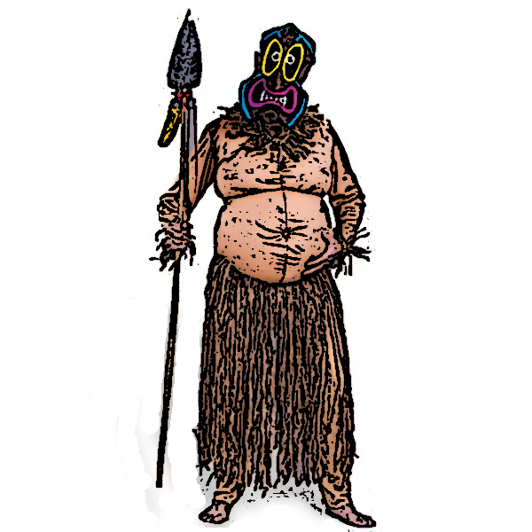

# kar | kahuna ambiguity resolver

kar is a search server that is operated over http. It is designed for websites and applications which need a fast and simple to set up string search ability. Written in C++ it is quite fast, and can be used for queries on hundreds of thousands of items. Internally words are stored in a trie which when queried are scored according to Levenshtein distance. 

## Building

### Server Requirements

* C++11 Compiler
* make
* libcppnetlib
* libboost_thread
* libboost_system
* libssl
* libcrypto

On Ubuntu you can install these requirements like this:

`sudo apt-get install g++ build-essential libcppnetlib-dev libboost-thread-dev libboost-system-dev libssl-dev libcrypto++-dev`

To build just run `make` in root directory.

### Client Requirements

A small example "client" is included. To use you must have PHP 5.3+ and [composer](https://getcomposer.org/).

Note: you may need to install / enable PHP's cURL extension.

Change into client directory: `cd client` then run `composer install` to install client dependencies.

Then `cd src` and `php example.php` - make sure the server is already running (and same port etc).

Read through this file to understand how to write your own client.

## Configuration

**Set a password**

## License

MIT
